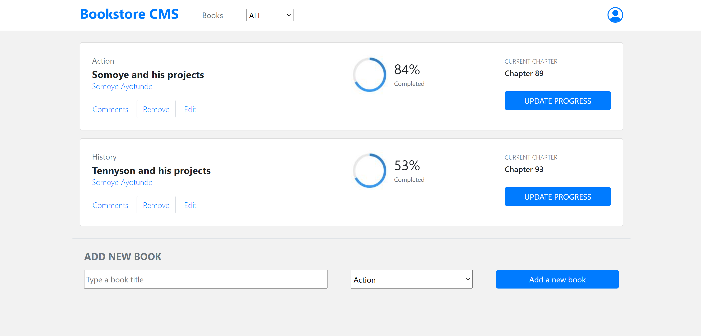

# Bookstore

In this project, we use React and Redux to build the front-end of an application that helps organize and manage a bookstore.

The project was split into multiple milestones, and each milestone has functional and technical requirements that we needed to implement.

## ScreenShot

## Live Demo
[Bookstore](https://somoye-tennyson.herokuapp.com)

## Built with
- Node.js
- React
- React-DOM
- React-Create-App
- Redux
- npm
- CSS
- ES6

## Getting Started

To get a local copy of the repository please run the following commands on your terminal:

```bash
$ git clone https://github.com/somoye123/Book-store.git
$ cd Book-store
$ npm install
$ npm start
```

### Prerequisites

- Node
- Npm

# Author

👤 **Somoye Ayotunde**

- Github:[@somoye123](https://github.com/somoye123)
- Twitter:[@ayotunde_197](https://twitter.com/ayotunde_197)
- LinkedIn:[Somoye Ayotunde](https://www.linkedin.com/in/somoye-ayotunde-03a471161)
- Mail: [somoye.ayotunde@gmail.com](somoye.ayotunde@gmail.com)

👤 **Tennyson Zvaita**

- Github:[@tzvaita](https://github.com/tzvaita)
- Twitter:[@tennyzvaita](https://twitter.com/tennyzvaita)
- LinkedIn:[tennyzvaita](https://www.linkedin.com/in/tennyzvaita)
- Mail: [tzvaita@gmail.com](tzvaita@gmail.com)

## 🤝 Contributing

Contributions, issues and feature requests are welcome!

Feel free to check the [issues page](https://github.com/somoye123/Book-store/issues).

## Show your support

Give a ⭐️ if you like this project!
